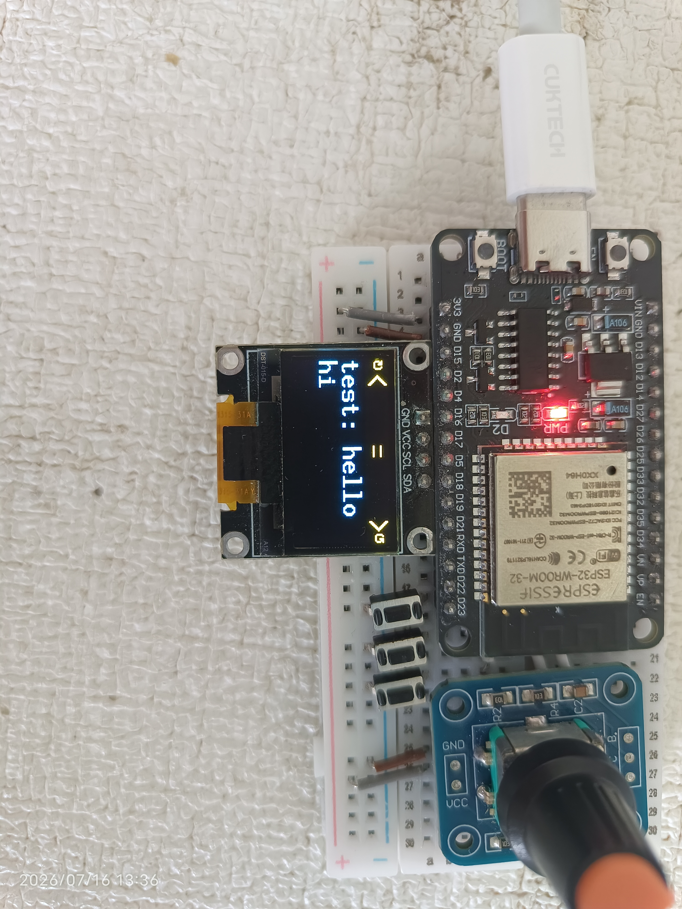

# 🎛️ ChatKnob - 旋钮 MQTT 聊天终端

[](https://opensource.org/licenses/MIT)

ChatKnob 是一个基于 ESP32 开发的硬件聊天终端。它摒弃了传统的实体键盘，利用 **旋转编码器** 和 **三个实体按键** 完成字符输入和发送。所有聊天信息通过 MQTT 协议在局域网/公网中传输，适合学习物联网通信、嵌入式 UI 设计以及自定义聊天硬件。

---

## ✨ 功能特性

- 🔄 **旋转选字**：旋转编码器在 **33~126（`!` ~ `~`）共 94 个 ASCII 可打印字符** 间平滑循环选择
- 🎯 **方向指示**：顶部导航栏显示 `↻` / `↺` 方向指示符，上下相邻字符同步预览，当前字符居中突出
- ✅ **三键操作**：
  - `Yes`：将当前字符追加到输入缓冲区末尾
  - `Back`：短按删除输入缓冲区最后一个字符（退格），长按进入菜单
  - `Send`：通过 MQTT 发送完整消息，并清空输入缓冲区
- 🖥️ **OLED 实时显示**：
  - 顶部导航栏：方向指示符 + 相邻字符 + 当前选中字符（居中）
  - 第二行：接收到的聊天消息（`ID: message`）
  - 第三行：正在构建的输入句子
- 🌐 **MQTT 通信**：自动获取 MAC 地址作为唯一设备 ID，支持在线/离线遗嘱消息（LWT）
- 📡 **WiFi 配网**：首次开机自动开启配网热点（`ChatKnob_AP`），手机/电脑连接后通过网页配置 WiFi
- 💡 **状态反馈**：按下 `Send` 键发送消息时，板载 LED 灯闪烁提示
- 🔁 **自动重连**：WiFi 或 MQTT 断线后自动重连，保证设备长期在线
- 📦 **开源协议**：MIT License，可自由使用、修改、商用

---

## 🖥️ UI 布局

```
┌──────────────────────────────────────────────────────────┐
│  ↻  上一个              [当前字符]              下一个  ↺ │  Y = 0
│  [接收到的消息]                                           │  Y = 16
│  [正在输入的句子]                                         │  Y = 32
└──────────────────────────────────────────────────────────┘
```

- 顶部导航栏：当前字符居中，左右显示相邻字符和方向指示符
- 消息接收区：显示最新的聊天消息
- 输入编辑区：显示正在构建的句子，实时更新

---

## 🛠️ 硬件需求

| 组件 | 型号/规格 | 数量 |
| :--- | :--- | :--- |
| **主控板** | ESP32 开发板（支持 WiFi 和 I2C） | 1 |
| **输入设备** | EC11 旋转编码器（立式直插） | 1 |
| **按键** | 独立微动按键（轻触开关） | 3 |
| **显示** | 0.96 英寸 OLED 屏幕（SSD1306，I2C 接口） | 1 |
| **指示** | 板载 LED（GPIO 2，高电平点亮） | 1 |

> **注意**：本项目的旋转编码器上的按压开关（SW）损坏，改用三个独立按键分别负责 `Yes`、`Back`、`Send`。

---

## 🔌 引脚接线表

| 硬件组件 | ESP32 引脚 | 说明 |
| :--- | :--- | :--- |
| **编码器 CLK** | GPIO 32 | A 相（正交信号） |
| **编码器 DT** | GPIO 25 | B 相（正交信号） |
| **OLED SDA** | GPIO 5 | I2C 数据线 |
| **OLED SCL** | GPIO 18 | I2C 时钟线 |
| **Yes 按键** | GPIO 23 | 输入（启用内部上拉） |
| **Back 按键** | GPIO 19 | 输入（启用内部上拉） |
| **Send 按键** | GPIO 21 | 输入（启用内部上拉） |
| **LED 指示灯** | GPIO 2 | 高电平点亮（发送时闪烁） |

---

## 📦 依赖库 (Arduino IDE)

在编译之前，请确保安装了以下库：

| 库名称 | 版本 | 用途 |
| :--- | :--- | :--- |
| **[U8g2](https://github.com/olikraus/u8g2)** | ≥ 2.36.19 | OLED 显示驱动 |
| **[PubSubClient](https://github.com/knolleary/pubsubclient)** | ≥ 2.8 | MQTT 通信 |
| **[ArduinoJson](https://github.com/bblanchon/ArduinoJson)** | ≥ 7.0 | JSON 数据解析 |
| **[ESP32Encoder](https://github.com/madhephaestus/ESP32Encoder)** | ≥ 0.12.0 | 旋转编码器计数 |
| **[WiFiManager](https://github.com/tzapu/WiFiManager)** | ≥ 2.0 | WiFi 配网 |

---

## ⚙️ 配置与烧录

1. 下载本仓库代码，用 Arduino IDE 打开 `ChatKnob.ino`。
2. 找到顶部的 MQTT 配置区域，修改以下宏定义：

```cpp
#define BROKER  "your_mqtt_broker"   // MQTT 服务器地址
#define PORT    1883                 // MQTT 端口
#define CHAT    "your_chat_topic"    // MQTT 主题（建议改为自定义字符串）
```

3. WiFi 配网无需硬编码，设备首次开机会自动创建 `ChatKnob_AP` 热点，通过手机配网即可。
4. 选择开发板：`Tools → Board → ESP32 Dev Module`。
5. 选择正确端口，点击 **Upload** 烧录。

---

## 🎮 如何使用

### 首次使用（配网）

1. **上电启动**：设备检测到没有保存的 WiFi 信息，自动创建 `ChatKnob_AP` 热点。
2. **连接热点**：用手机或电脑连接该热点（无密码）。
3. **配网**：浏览器自动弹出配网页，选择你的 WiFi 并输入密码。
4. **自动重启**：配网成功后设备自动重启，连接到你配置的 WiFi。

### 日常使用

1. **选字符**：旋转编码器，顶部导航栏的字符会从 `!` 到 `~` 平滑循环，当前字符居中突出。
2. **拼消息**：
   - 旋转到目标字符，按下 **Yes** 键，该字符追加到输入缓冲区（屏幕第三行显示）。
   - 如果输错了，按下 **Back** 键删除最后一个字符。
3. **发送**：按下 **Send** 键，完整消息通过 MQTT 发布，输入缓冲区自动清空，LED 闪烁提示。
4. **接收消息**：其他设备发来的消息会显示在屏幕第二行（格式：`发送者ID: 消息内容`）。

### 长按操作

- **长按 Back 键（2 秒）**：进入菜单（功能开发中）。

### 更换 WiFi

如需更换 WiFi 网络，在代码中取消 `wm.resetSettings();` 的注释，烧录一次即可清除保存的 WiFi 信息，设备会重新进入配网模式。

---

## 📂 代码结构

```text
ChatKnob.ino
├── 配置区 (WiFi / MQTT / 引脚定义 / 常量)
├── setup()
│   ├── pin_init()          // 统一引脚模式设置（编码器 + 按键 + LED）
│   ├── encoder_init()      // 编码器库挂载与滤波设置
│   ├── oled_init()         // OLED 驱动与字体
│   ├── wifi_init()         // WiFi 连接（含 WiFiManager 配网）
│   ├── Generate_MAC_ID()   // MAC 地址 → 设备 ID
│   ├── mqtt_init()         // MQTT 连接 + 遗嘱 + 订阅（带重试）
│   └── send_message("online", 1) // 上线通知
├── loop()
│   ├── mqttClient.loop()   // MQTT 心跳
│   ├── MQTT 断线检测 & 重连
│   ├── letter()            // 编码器 → 字符映射（取模循环）
│   ├── 按键检测 (Yes/Back/Send)
│   ├── refresh → show()    // 统一刷新 OLED
│   └── inMenu → menu()     // 菜单入口（占位）
├── send_message()          // 统一输出接口
│   ├── mode=1 → MQTT 发布
│   ├── mode=2 → OLED 打印（主字体）
│   ├── mode=3 → OLED 打印（符号字体）
│   └── mode=4 → OLED 清屏并打印（紧急消息）
├── mqttCallback()          // 接收消息解析
└── 其他辅助函数
```

---

## 📷 效果展示



---

## 🤝 贡献

欢迎提交 Issue 或 Pull Request，也欢迎 fork 本仓库打造属于你自己的版本！

---

## 📜 许可证

本项目采用 **MIT License**，可自由使用、修改、分发，甚至用于商业项目。只需保留原始版权声明即可。
